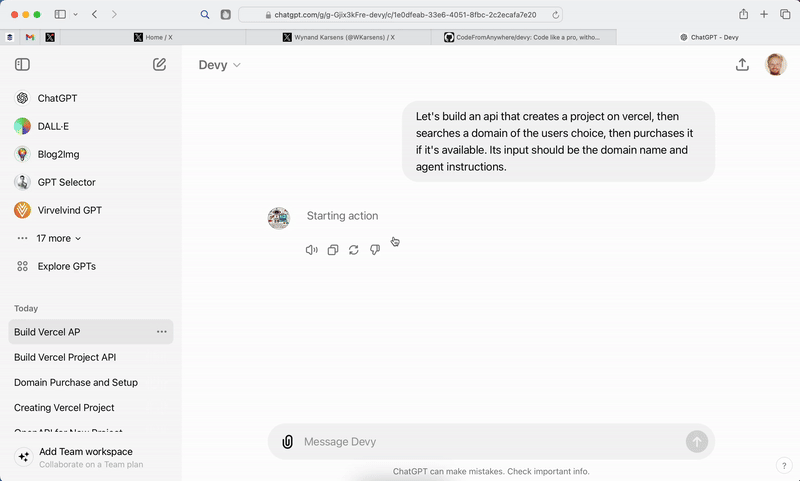

> This would be an improved version of a Github agent, allowing any user to auth with github (or not), and get things done there. Should also work for public repos that the repo owner didn't give access to. Not sure if that's possible, unless we use browser automation, but that would be the ultimate way to get this to scale madly.

# From Idea to Hosted API

Code like a pro, without the expertise. Myelin uses RAG to retreive code documentation from many apis, writes perfect code, and hosts your solution on your own GitHub and Vercel Server.

## ⚠️⚠️⚠️ This is a Work in Progress. [Be notified](https://docs.google.com/forms/d/e/1FAIpQLSckizJWBSb9i-sGiqL6-19JwnhB09LKyWaFXO7bYKXvEFo2Ug/viewform?usp=pp_url&entry.593481734=https://x.com/) for early access! ⚠️⚠️⚠️

The Ultimate GPT lets you login with GitHub/Vercel, then basically code any small project in natural language. Coding on the go via whatsapp/phonecall? No problem. Approve your prs later.

Start chatting for free (coming soon):

- [ChatGPT](https://chatgpt.com/g/g-Gjix3kFre)

Or use it on-the-go (premium, coming soon):

- [Whatsapp (+1 555 555 5555)](https://wa.me/1XXXXXXXXXX?text=I%20wanna%20build%20...)
- [Phonecall (+1 555 555 5555)](tel:555-555-5555)

Or build with Cody:

- [OpenAPI (coming soon)](public/openapi.json)
- [Docs & Code](https://github.com/CodeFromAnywhere)

## How it works

1. you talk about your idea with AI
2. ai comes up with a precise specification
3. ai chooses apis
4. ai chooses operations
5. ai gets specification
6. ai implements solution
7. you login with github to push
8. you login with vercel to make the project
9. you login with actionschema to store your openapi
10. ai asks another agent to test your API

## SWE Iteration: Devin-like Github Issue AI SWE

> Trigger: New issue

User feedback + Brainstorm todo list?

⬇️ Has Many

User Story Issue?

⬇️ Has Many

Based on file/folder-hierarchy and the user story ticket, which files/endpoints are relevant? What are the implementation details and additional context needed on a per-file basis? Work this out in issue (show expander)

## What is needed for such a flow?

- Data entry: github repo creation, issue creation, repo lookup/search, issue lookup/search (this can be a voice agent)
- GitHub integration: Oauth2 github private repo access, trigger for new issues created
- Generating a 'file/folder-hierarchy object' with summaries per file and folder, for any repo, that is kept in-sync.
- Ability to branch out from the base branch, make changes, and create a draft PR for it
- Listener to wait for deployment of PR that tests result e2e and confirms its workings or declines it and alters the todo list. If confirmed, undraft the PR.

If I can do this for each and every github issue on my own backends, that would be huge. Let's fork it privately, and test it with real issues from linear (manual copy/paste). The bot should automatically make a Draft PR with proposed changes. If the draft PR automatically gets hosted on a feature branch, it'd be perfect, as then the agent could test its own code changes via the openapi. This should be supported if comments for re-deployment happen, and if an `/openapi.json` is available.

## Being made with ❤️ by [wkarsens](https://x.com/wkarsens) 🇳🇱

# Inspiration

